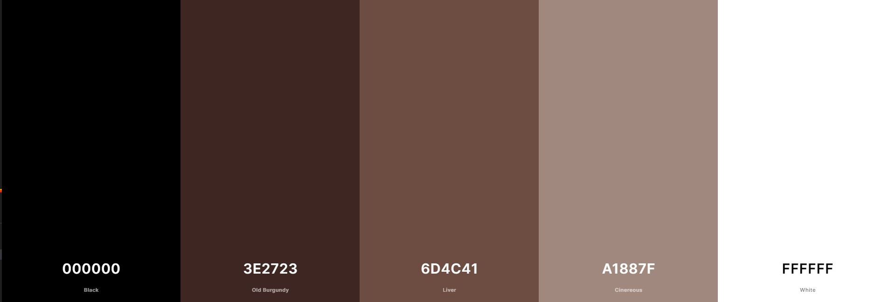

# Bookmarked

Bookmarked is a digital library for users to upload and organize their books. I decided to create Bookmarked because I personally have a lot of books, too many books to fit on my bookshelves so I end up giving some away or lending them to friends or family to read resulting in me forgetting what books I have owned or read. To fix this I wanted to create a website where I could add all my books so I can keep track of them all even if I don’t physically have them in my possession. I also wanted to create an option to create Bookshelves so that I could organize them such has have Fantasy books grouped together or have a digital TBR (To be read list) to keep track of all the books I want to read in the future. Finally I wanted to have a feature that would generate a book for me, because I buy books at a faster rate than I can read them it can become overwhelming trying to chose which one to read next. I wanted to be able to generate a book from some parameters such as from a specific author or bookshelf or just generate a book based on my whole library. 

View Website - 

## UX

For the website I want the design to be simple so that its easy for the user to navigate. I want to keep the background white and use brown tones throughout the website to play on the idea of it being a digital library. Users will also have the oportunity to select a colour for each of the books they create so their bookshelves can be personalized to their style. 

### User Stories
 
-	As a user I want to be able to easily create books
-	As a user I want to be able to easily create bookshelves
-	As a user I want to be able to easily edit books
-	As a user I want to be able to easily delete books
-	As a user I want to be able to easily delete bookshelves
-	As a user I want to be able to add comments to my books

### Colour Scheme
    
Throughout the website I want the theme to be a white background with tones of brown for the navigation and buttons to play on the theme of bookshelves. I also want all of the pages to have the same styling and colours so that they flow together so I will be using the same colouring and styling for components throughout the website. 

Main colours used throughout the website

### Typography
    
For the Typography I want to use a font that is lightweight, simple and clean. I kept the fonts the same throughout the website so that the website matched and looked unified.

I also used icons throughout my website for some of the different options.

### Wireframes

For the design of my app I used wireframes to visulize what I wanted each page to contain and a rough guide for how I wanted it to be laid out, this ensured that not only did I include all the features I wanted but also that i wasnt trying to design and create the website at the same time. 

#### Login Page Wireframes

#### Signup Page Wireframes

#### Profile Page Wireframes

#### Create Bookshelf Page Wireframes

#### Bookshelf Books Wireframes

#### Generate Book Wireframes

#### Create Books Page Wireframes

#### Create Edit Wireframes

#### Display Book Page Wireframes

#### Add Comment Wireframes

#### Display Generated Book Wireframes
     
## Features

For this project I wanted the user to be able to create an online library which they can keep track of all their books and organzie them onto bookshelves. I also wanted a feature where they would be able to generate a book for when they cant decide what to read next.

### Existing Features

#### Navbar

Since my website doesnt have many pages I wanted the navbar to be kept pretty basic and simple. On the left I have the app name and then on the right is the links to other pages of the website. I added a simple hover effect to each of the links so that the user knows what area they are currently hovering over.

#### Button Hovers

For all of the buttons I wanted to add a hover and focus effect so that the user knows when they are currently hover overing a button. I didnt want a drastic change, just something simple but noticable. In the end I decided to change the background colour to a slightly lighter shade of brown and also I remove the button box shadow so it gives the visual effect of a button being pressed down

Normal

Active 

#### Login page

When you land on the website it takes your directly to the login page which I kept very simple with just a input field for users username and password and a submit button. Underneath the login form there is also a button for users to create an account if they dont already have one.

#### Sign up Page

For the form to create an account I kept the design the same as the login form but just added extra fields for the information needed. When you click on a field and it becomes active the icon turns brown so that the user knows what input they are on. 

If the user clicks out of the feild without all the requirements being met such as it being the right length a red bar underlines the feild notifying the user something is wrong.

Once the issue is corrected the underline then turns green signaling that the user is ok to continue. 

#### Home Page

Personalized welcome message

Users bookshelves

On the users profile its split up into three sections. One of the sections displays the users bookhelves, from here they are able to create new bookshelves, edit their already existing ones or delete an already existing bookshelf. 

Generate Book

From their homepage the user also has a section where they can generate a random book to read next. 

Users books

The last section on the users profile displays all of the books the user has inputed into their account.

#### Bookshelves page

Another way the user can view their bookshelves is to click on the bookshelf link in the navbar, this will quickly redirect them to a page displaying all of their bookshelves

#### Create Bookshelf Feature

#### Create Book Feature

#### Generate Book From Bookshelves

#### Generate Book From Authors

#### Generate Book From Genres

#### Generate Book From Whole Library

#### Add comments to books

#### Edit Books

### Features Left to Implement

    A feature I would like to implement is to attatch an api to the app so that when users create a book it will search the api and bring up the book cover and display that on the bookcase. 

## Technologies Used
    
    Throughout the project I used a variety of technologies.

    - I used Balsamiq to design my wireframes [Balsamiq Website](https://balsamiq.com/)
    - I used HTML and CSS to create and style the website.
    - I used github to create a repository for my project.[Github Website](https://github.com/)
    - I used gitpod as the development environment.[Gitpod Website](https://gitpod.io/)
    - I used  MongoDB for one of my databases [MongoDB Website](https://www.mongodb.com/)
    - I used Jinja as a templating language [Jinja Website](https://jinja.palletsprojects.com/en/3.1.x/)
    - I used PSQL for one of the databases [PSQL Website](https://www.postgresql.org/)
    - I used Hiroku to host my website [Hiroku Website](https://dashboard.heroku.com/)

## Testing
    "For all testing, please refer to the [TESTING.md](TESTING.md) file."
## Deployment
    document all necessary steps you did in order to deploy this project (GitHub Pages, Heroku, etc.)
### Local Deployment
    document all the necessary steps someone else can take in order to make a local copy of your project, like cloning, forking, etc.
## Credits
    explain about any particular places you took inspiration from
### Content
    list out any URLs or links where you might've borrowed a snippet of code, or element
### Media
    list out any URLs for images/videos/audios you've borrowed from online (Markdown Table works best here!)
### Acknowledgements
    list out any acknowledgements you have, if any... tutor support? fellow Slack student help? spouse, loved one, family member, etc.
​
​
​
TESTING.md file (ideally, separate from the README.md file, but also at root-level same as the readme and index files)
​
# Testing
    "Click to return back to the [README.md](README.md)"
## Browser Compatibility
    you must showcase proof with screenshots that you've tested the finished project on various browsers, such as Chrome, Firefox, Edge, Safari, Brave, etc.
## Code Validation
    you must showcase proof with screenshots that you've validated any code files, such as HTML, CSS, JS, Python (where applicable)
## Responsiveness
    you must showcase proof with screenshots that you've tested the finished project on different device sizes, such as mobile, tablet, desktop.
## User Story Testing
    This is simple: copy/paste your User Stories from the README, paste them here, and then simply just take the existing screenshots from "Features" section that align with each User Story, and TADA!
## Unfixed Bugs
    list out any unfinished bugs you might have, where applicable... if none, don't just put "I have no bugs"... put something like: "There are no remaining bugs that I am aware of."