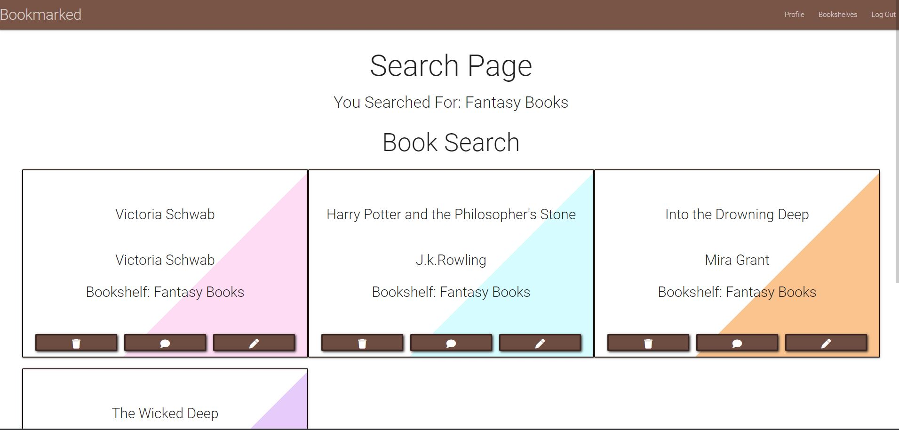

# Bookmarked

Bookmarked is a digital library for users to keep a digital footprint of what books they have owned and read. It allows users to create digital version of their books which they can then organize onto custom bookshelves. 

## App Purpose
I decided to create Bookmarked because I personally have a lot of books, too many books to fit on my bookshelves so I end up giving some away or lending them to friends or family to read resulting in me forgetting what books I have owned or read. To fix this I wanted to create a website where I could add all my books so I can keep track of them all even if I don’t physically have them in my possession. I also wanted to create an option to create Bookshelves so that I could organize them such has have Fantasy books grouped together or have a digital TBR (To be read list) to keep track of all the books I want to read in the future. Finally I wanted to have a feature that would generate a book for me, because I buy books at a faster rate than I can read them it can become overwhelming trying to chose which one to read next. I wanted to be able to generate a book from some parameters such as from a specific author or bookshelf or just generate a book based on my whole library.

View Website - https://bookmarked-app.herokuapp.com/

## UX

For the website I want the design to be simple so that its easy for the user to navigate. I want to keep the background white and use brown tones throughout the website to play on the idea of it being a digital library. Users will also have the oportunity to select a colour for each of the books they create so their bookshelves can be personalized to their style. 

### User Stories
 
-	As a user I want to be able to create an account
-   As a user i want to be able to log into my account
-	As a user I want to be able to easily create books
-	As a user I want to be able to easily delete books
-	As a user I want to be able to easily edit books
-	As a user I want to be able to easily create bookshelves
-	As a user I want to be able to easily delete bookshelves
-	As a user I want to be able to add comments to my books
-   As a user I want to be able to delete comments from my books
-   As a user i want to be able to randomly generate a book from my collections
-   As a user i want to be able to search through my books

### Colour Scheme
    
Throughout the website I want the theme to be a white background with tones of brown for the navigation and buttons to play on the theme of bookshelves. I also want all of the pages to have the same styling and colours so that they flow together so I will be using the same colouring and styling for components throughout the website. 

Main colours used throughout the website

### Typography
    
For the Typography I want to use a font that is lightweight, simple and clean. I kept the fonts the same throughout the website so that the website matched and looked unified.

I also used icons throughout my website for some of the different options.

### Wireframes

For the design of my app I used wireframes to visulize what I wanted each page to contain and a rough guide for how I wanted it to be laid out, this ensured that not only did I include all the features I wanted but also that i wasnt trying to design and create the website at the same time. 

#### Login Page Wireframes

#### Signup Page Wireframes

#### Profile Page Wireframes

#### Create Bookshelf Page Wireframes

#### Bookshelf Books Wireframes

#### Generate Book Wireframes

#### Create Books Page Wireframes

#### Create Edit Wireframes

#### Display Book Page Wireframes

#### Display Generated Book Wireframes
     

## Features

For this project I wanted the user to be able to create an online library which they can keep track of all their books and organzie them onto bookshelves. I also wanted a feature where they would be able to generate a book for when they cant decide what to read next.

### Existing Features

#### Navbar

Since my website doesnt have many pages I wanted the navbar to be kept pretty basic and simple. On the left I have the app name and then on the right is the links to other pages of the website. I added a simple hover effect to each of the links so that the user knows what area they are currently hovering over.

#### Button Hovers

For all of the buttons I wanted to add a hover and focus effect so that the user knows when they are currently hover overing a button. I didnt want a drastic change, just something simple but noticable. In the end I decided to change the background colour to a slightly lighter shade of brown and also I remove the button box shadow so it gives the visual effect of a button being pressed down

Normal

Active 

#### Login page

When you land on the website it takes your directly to the login page which I kept very simple with just a input field for users username and password and a submit button. Underneath the login form there is also a button for users to create an account if they dont already have one.

#### Sign up Page

For the form to create an account I kept the design the same as the login form but just added extra fields for the information needed. When you click on a field and it becomes active the icon turns brown so that the user knows what input they are on. 

If the user clicks out of the feild without all the requirements being met such as it being the right length a red bar underlines the feild notifying the user something is wrong.

Once the issue is corrected the underline then turns green signaling that the user is ok to continue. 

#### Home Page

Personalized welcome message

Users bookshelves

On the users profile its split up into three sections. One of the sections displays the users bookhelves, from here they are able to create new bookshelves, edit their already existing ones or delete an already existing bookshelf. 

Generate Book

From their homepage the user also has a section where they can generate a random book to read next. 

Users books

The last section on the users profile displays all of the books the user has inputed into their account.

#### Bookshelves page

Another way the user can view their bookshelves is to click on the bookshelf link in the navbar, this will quickly redirect them to a page displaying all of their bookshelves

#### Create Bookshelf Feature

To allow users to organize their books they have the option to create bookshelves which they can then assign books to. For example they might want to create a Fantasy books and which they can then store all of their fantasy books on.

#### Create Book Feature

Being an online library it only makes sense that users wil be able to add books to their profiles. As part of the add book form users will be able to give their books a title and author as well as adding tags, assigning it to a bookshelf, selecting a book colour and adding in a book description. 

#### Generate Book

A feature I was keen to include was a book generation option, sometimes it can be overwhelming trying to decide what book to read next when you have multiple unread books so I wanted to create a feature to take the decision making away. Users will be able given the option to generate a book from on of their bookshelves, a specific author, a by tag or randomly out of their entire library.

#### Add comments to books

I wanted to give the user the option to add comments or notes to their books where they could comment on if they liked it or not or just add notes that they can refer back to in the future.

#### Edit Books

The last feature I implemented was to allow the user to edit a book they have created, they might want to edit it if they made a typo or they want to change the book colour for example so instead of them having to delete the whole book and remake it I added in an edit button. The edit form auto fills in with the existing information allowing the user to just edit the content they want to. 

### Features Left to Implement

A feature I would like to implement is to attatch an api to the app so that when users create a book it will search the api and bring up the book cover and display that on the bookcase. 

## Technologies Used
    
Throughout the project I used a variety of technologies.

- I used Balsamiq to design my wireframes [Balsamiq Website](https://balsamiq.com/)
- I used HTML and CSS to create and style the website.
- I used github to create a repository for my project.[Github Website](https://github.com/)
- I used gitpod as the development environment.[Gitpod Website](https://gitpod.io/)
- I used  MongoDB for one of my databases [MongoDB Website](https://www.mongodb.com/)
- I used Jinja as a templating language [Jinja Website](https://jinja.palletsprojects.com/en/3.1.x/)
- I used PSQL for one of the databases [PSQL Website](https://www.postgresql.org/)
- I used Hiroku to host my website [Hiroku Website](https://dashboard.heroku.com/)

## Data Schema and Relationships
 

The app useses two databased one in MongoDB and the other in PostgreSQL.

The PostgreSQL database holds the bookshelf and user account information while the PostgreSQL database holds the books information. 

For the bookshelf information is stores a record of a unique id so each bookcase can be called upon aswell as a the bookshelf name and bookshelf description. It also stores the username of the user who created it.

For the Username information it stores a unique id and also the username and password the user used when they created their account. 

The books databse stores a unique ID so that each book can be called upon as well as a book title, author, genre, description, the bookshelf id of the bookshelf the book is assigned to, comments, created by and colour. 

The bookshelf PostgreSQL databse and the Books MongoDB database are related as the books database has to be aware of the information on the bookshelf database in order to work. 
The books database needs both the bookshelf_id and createdBy information from the bookshelf PostgreSQL database as it uses this information when displaying the books to the user. This information is also used so that only the person who created the books can delete or edit them. 

## Testing

I have created a seperate document for the tests I conducted, it can be found [Here](TESTING.md)

## Deployment

#### Github

1. To clone the repository, type the following command into your terminal:
    - git clone https://github.com/Claire221/bookmarked
2. Navigate from the cloned directory to your directory using the CD terminal command
3. Create an env.py file in the root directory and set up the necessary environment variables. 
    - At the top of the file type -  import os
    - Create the MONGO_URI and SECRET_KEY variables
    - Set the IP and PORT
4. Install the requirements.txt file using the command: 'pip3 install -r requirements.txt'
5. Navigate to MongoDB and create a databsae called "Bookmarked" and add the following collection:
    - Books
        - Title
        - Author
        - Genre
        - Description
        - Bookshelf
        - Comments
        - createdBy
        - Colour
6. Run the app using the command python3 app.py

### Heroku 
The site is hosted on [Heroku](https://dashboard.heroku.com/)

To deploy on heroku you will need to create a requirements.txt and Procfile.
- For the requirements.txt you need to include all the applications that are required to run the app.
- The Procfile specifies what commands need to be executed by the app on startup.
- With these files created you can then login or sign up to [Heroku](https://dashboard.heroku.com/)
- You will then need to select Create new app.
- Heroku apps need to have unique names so select a name and then select your region.
- Once the app has been created you can select the Deploy at the top of the page.
- Scroll down to the Deployment methods and select Github.
- You will then need to select your username and repository repo name, once you have selected them select Connect
- Under Manual Deplop you want to select the branch you wish to deploy and hit Deploy Branch.
- Once the app has been deployed you then need to go back to the top of the page and select Settings
- Once in the settings menu you need to select Reveal Config Vars
- You need to add in the values and keys for DATABASE_URL, IP, MONGO_DBNAME, MONGO_URI, PORT and SECRET_KEY
- Once you have entered in your Config Vars you should be able to view the site by pressing Open app at the very top of the page

### Media

Throughout the website I used a variery of images and artworks.
- Profile header background image - [Profile header background](https://images.unsplash.com/photo-1535905748047-14b2415c77d5?ixlib=rb-1.2.1&ixid=MnwxMjA3fDB8MHxwaG90by1wYWdlfHx8fGVufDB8fHx8&auto=format&fit=crop&w=1150&q=80)
- Profile generate book section background - [generate book section background](https://images.unsplash.com/photo-1485322551133-3a4c27a9d925?ixlib=rb-1.2.1&ixid=MnwxMjA3fDB8MHxwaG90by1wYWdlfHx8fGVufDB8fHx8&auto=format&fit=crop&w=1170&q=80)
- Display book background - [Display book background](https://images.unsplash.com/photo-1515125520141-3e3b67bc0a88?ixlib=rb-1.2.1&ixid=MnwxMjA3fDB8MHxwaG90by1wYWdlfHx8fGVufDB8fHx8&auto=format&fit=crop&w=1171&q=80)

​
​​