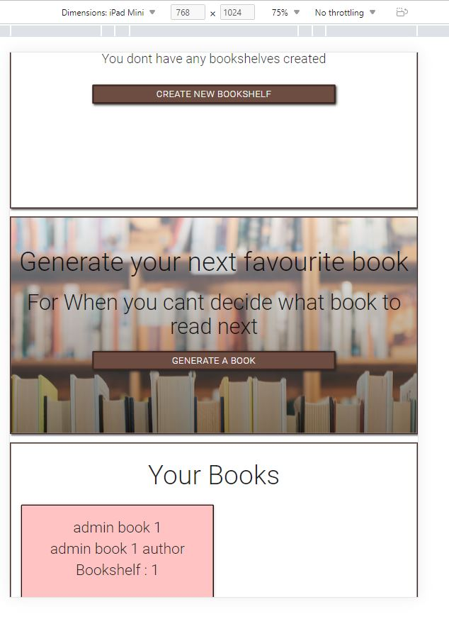

# Testing

Click to return back to the [README.md](README.md)

## Browser Compatibility and Responsiveness 

For each of my pages I will check them against the top 3 web browsers - Google chrome, Firefox and Microsoft Edge. I initialy checked that all the elements were loading as they should on all 3 browsers.
Once I confirmed they were working as expected I then went into the devtools and changed the viewport width to check the layout and styles against different device sizes.

| Browser        | Screen Size | Image |
| :----:         |    :----:   | :----:|
| Chrome         | Desktop     |   | 
| Firefox        | Desktop     |  |
| Microsoft Edge | Desktop     |    |
|                |             |                                                                                     |
| Chrome         | Ipad        |  | 
| Firefox        | Ipad        | |
| Microsoft Edge | Ipad        | )   |
|                |             |                                                                                     | 
| Chrome         | Mobile      |    | 
| Firefox        | Mobile      |   |
| Microsoft Edge | Mobile      |      |

## Code Validation

### HTML Validation

Once I had finished my website I ran each page throigh a HTML validator to ensure that the code was correct.

### CSS Validation

I ran my CSS through a validator to ensure that it was correct. It passed the validation and came back with no errors.

### PEP8 Validation 

I also ran my Python code through a PEP8 Validator to make sure that it was PEP8 compliant 

## User Story Testing

Once I had finished the app I decided to go through and test each element to make sure they were working correctly.

### Account Creation

First I checked that users could create accounts successfully

### Create Bookshelf

I then checked the create bookshelf function

### Delete Bookshelf

I then wanted to test that the delete bookshelf feature deleted the bookshelf successfully.

### Delete Bookshelf - Not user who created it

### Create Book

I wanted to test that users could successfuly add books so I created a few test books.

### Delete Book

I wanted to test that users could successfuly delete a book so I created a test book that I could test the function on.

### Edit Book

The users have the option to edit books to update the title, description, colour ect so I wandted to check that this works.

### Generate Book From Bookshelves 

There is also a feature where users can generate a random book based on different conditions so I wanted to test that these were all working correctly. I started by testing the bookshelf generation function

### Generate Book From Authors

I then tested the generate from authors function.

### Generate Book From Tags

### Generate Book From All Books

Finally I tested the generate from all the users books function.

## Unfixed Bugs
    list out any unfinished bugs you might have, where applicable... if none, don't just put "I have no bugs"... put something like: "There are no remaining bugs that I am aware of."