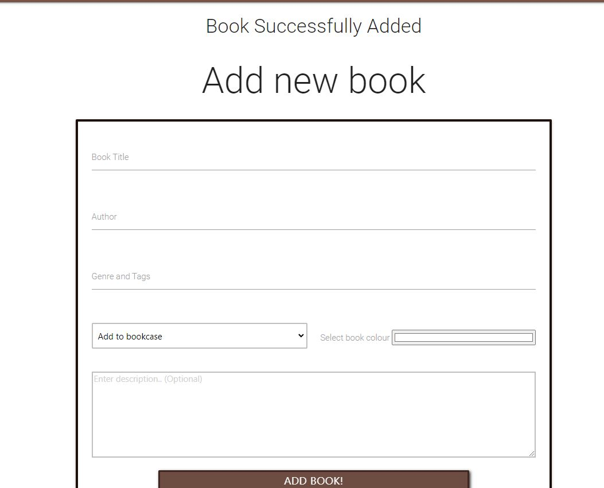
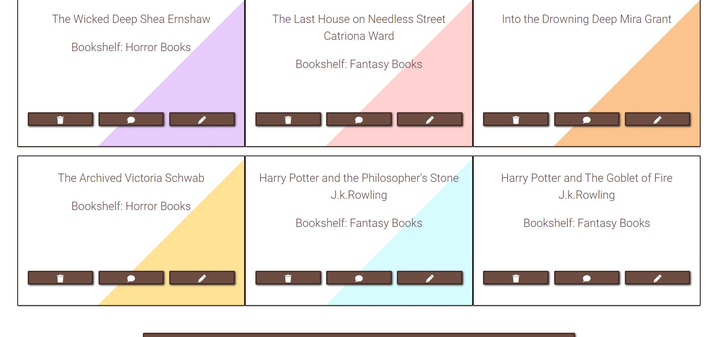
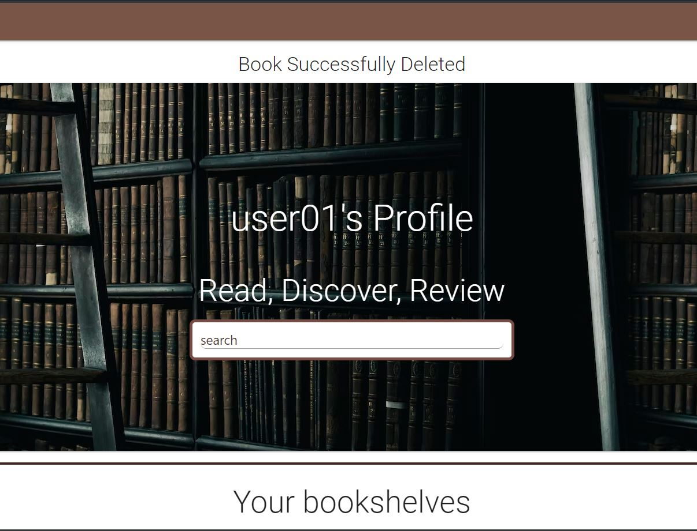

# Testing

Click to return back to the [README.md](README.md)

## Browser Compatibility and Responsiveness 

For each of my pages I will check them against the top 3 web browsers - Google chrome, Firefox and Microsoft Edge. I initialy checked that all the elements were loading as they should on all 3 browsers.
Once I confirmed they were working as expected I then went into the devtools and changed the viewport width to check the layout and styles against different device sizes.

| Browser        | Screen Size | Image |
| :----:         |    :----:   | :----:|
| Chrome         | Desktop     |   | 
| Firefox        | Desktop     |  |
| Microsoft Edge | Desktop     |    |
|                |             |                                                                                     |
| Chrome         | Ipad        |  | 
| Firefox        | Ipad        | |
| Microsoft Edge | Ipad        | )   |
|                |             |                                                                                     | 
| Chrome         | Mobile      |    | 
| Firefox        | Mobile      |   |
| Microsoft Edge | Mobile      |      |

## Code Validation

### HTML Validation

Once I had finished my website I ran each page throigh a HTML validator to ensure that the code was correct.

| Page                                  | Validation Result                                     |
| :----:                                |    :----:                                                                              | 
| Login Page Validator                  |  |
| Signup Page Validator                 |  |
| Profile Page Validator                |  |
| Bookshelf Page Validator              |  |
| Add Bookshelf Page Validator          |  |
| Book Page Validator                   |  |
| Add Book Page Validator               |  |
| Book Generator Page Validator         |  |
| Book Generator Results Page Validator |  |

### CSS Validation

I ran my CSS through a validator to ensure that it was correct. It passed the validation and came back with no errors.

### PEP8 Validation 

I also ran my Python code through a PEP8 Validator to make sure that it was PEP8 compliant 

### User Story Testing

Once I had finished the app I decided to go through and test each element to make sure they were working correctly.

| User Story:                                               | As a user I want to be able to create an account                              |        | 
| :----:                                                    | :----:                                                                        | :----: |
|Expected Outcome                                           | ScreenShot                                                                    | Result |
|Show any errors if user leaves out inputs in form          |           | Pass   |
|If user has filled out form correctly inputs will be green |       | Pass   |
|Redirect user to profile after creating account            |    | Pass   |

| User Story:                                               | As a user i want to be able to log into my account                            |        | 
| :----:                                                    | :----:                                                                        | :----: |
|Expected Outcome                                           | ScreenShot                                                                    | Result |
|Display message if user enters wrong passwor/username      |   | Pass   |
|Display welcome message if user logs in correctly          |       | Pass   |

| User Story:                                                | As a user i want to be able to log into my account                                     |        | 
| :----:                                                     | :----:                                                                                 | :----: |
|Expected Outcome                                            | ScreenShot                                                                             | Result |
|Show an error if user leaves out inputs in form             |              | Pass   |
|Display message when book is created to notify user         |    | Pass   |

| User Story:                                                | As a user I want to be able to easily delete books                                  |        | 
| :----:                                                     | :----:                                                                              | :----: |
|Expected Outcome                                            | ScreenShot                                                                          | Result |
|Book is removed from books displayed books                  |   | Pass   |
|                                                            |     | Pass   |
|Display message notifying user book gas been removed         |         | Pass   |

| User Story:                                                | As a user I want to be able to easily edit books                                    |        | 
| :----:                                                     | :----:                                                                              | :----: |
|Expected Outcome                                            | ScreenShot                                                                          | Result |
|Display message notifying user book as been edited          |         | Pass   |
|Update book with user edits                                 |                     | Pass   |

| User Story:                                                | As a user I want to be able to easily create bookshelves                            |        | 
| :----:                                                     | :----:                                                                              | :----: |
|Expected Outcome                                            | ScreenShot                                                                          | Result |
|Show an error if user leaves out inputs in form             |       | Pass   |
|Display new bookcase                                        |       | Pass   |

| User Story:                                                | As a user I want to be able to easily delete bookshelves                              |        | 
| :----:                                                     | :----:                                                                                | :----: |
|Expected Outcome                                            | ScreenShot                                                                            | Result |
|Book is removed from bookshelf  displayed bookshelves       | | Pass   |
|Display message notifying user bookshelf has been removed   |   | Pass   |

| User Story:                                                | As a user I want to be able to add comments to my books                               |        | 
| :----:                                                     | :----:                                                                                | :----: |
|Expected Outcome                                            | ScreenShot                                                                            | Result |
|Display message notifying user comment has been added       |            | Pass   |
|Display users comment                                       |        | Pass   |

| User Story:                                                | As a user I want to be able to delete comments from my books                          |        | 
| :----:                                                     | :----:                                                                                | :----: |
|Expected Outcome                                            | ScreenShot                                                                            | Result |
|Display message notifying user comment has been deleted     |           | Pass   |
|Remove comment from page                                    |   | Pass   |

| User Story:                                                | As a user i want to be able to randomly generate a book from my collections           |        | 
| :----:                                                     | :----:                                                                                | :----: |
|Expected Outcome                                            | ScreenShot                                                                            | Result |
|Display forms with book generations options                 |            | Pass   |
|If no books are found display message to user               |           | Pass   |
|Display generated book                                      |          | Pass   |

| User Story:                                                | As a user i want to be able to search through my books                                |        | 
| :----:                                                     | :----:                                                                                | :----: |
|Expected Outcome                                            | ScreenShot                                                                            | Result |
|Display message if no books were found                      |             | Pass   |
|Display search results                                      |           | Pass   |

### Manual Testing

| Test                   | Expected Outcome                                                                         | Result   | 
| :----:                 |  :----:                                                                                  | :----:   |
| Brand redired          | Redirects user to profile page when they click on teh brand name in navbar               | Pass     |
| Nav Hover              | Navbar link background change when user hovers over link                                 | Pass     |
| Nav Link - Profile     | Navbar profile link directs user to profile page                                         | Pass     |
| Nav Link - bookshelves | Navbar bookshelf link directs user to bookshelves page                                   | Pass     |
| Nav Link - Log Out     | Navbar log out link logs user out of their account                                       | Pass     |
| Buttons hover effect   | All buttons throughout the page display a hover effect when user hovers over them        | Pass     |
| Buttons focus effect   | All buttons throughout the page display a focus effect when user focuses on them         | Pass     |

## Unfixed Bugs
There are no remaining bugs that I am aware of.